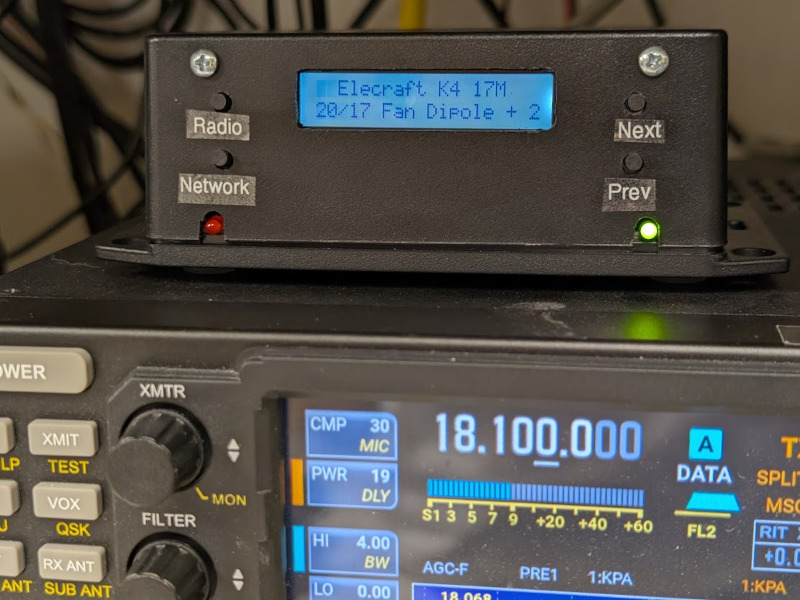
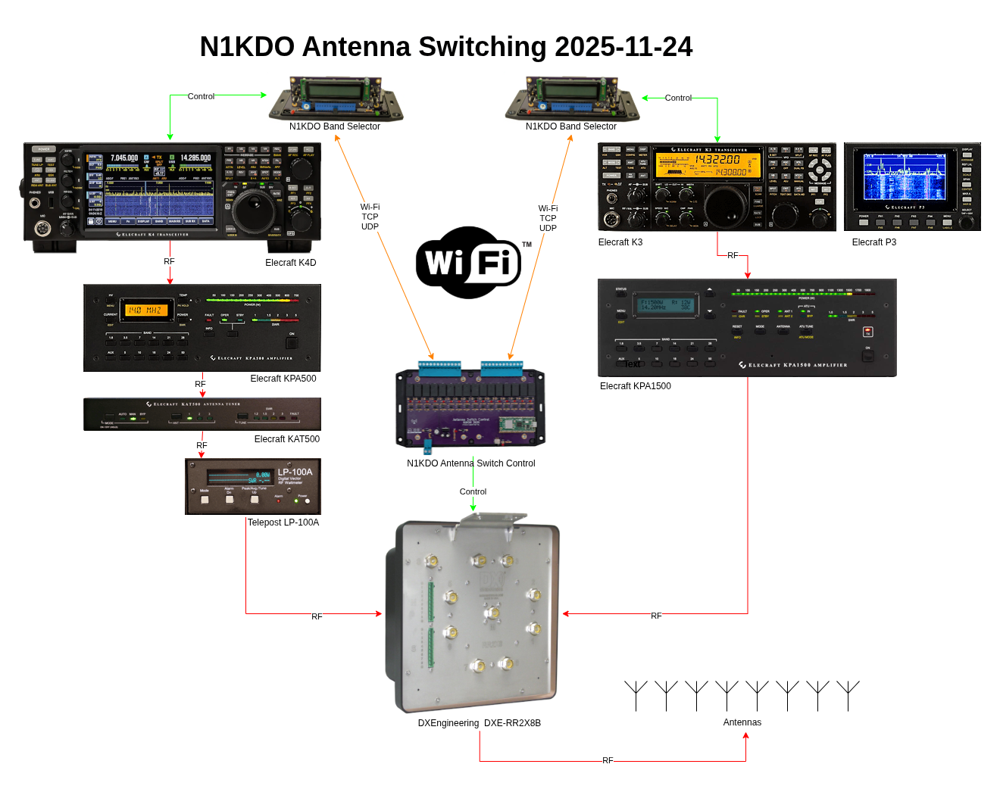
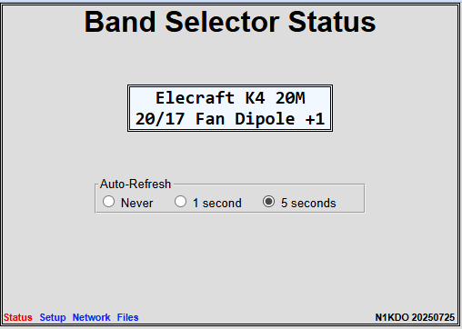
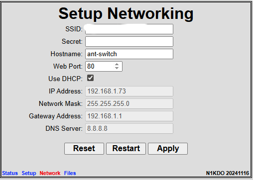
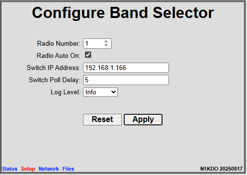

# N1KDO IOT Band Selector for Elecraft K3 & K4 

This project is intended to operate a remote antenna switch.

How is it different from commercial-off-the-shelf solutions?
* Direct interface with Elecraft 15-Pin accessory interface. It reads
  BCD band data using the Elecraft Y-cable or a device like a Y-box.
  * provides transmit inhibit and power-on sense/control.
  * it's not designed for other radios.  Tested on Elecraft only. It _should_ 
    work with other radios that use similar BCD active low band signaling. 
* Wireless! It runs over Wi-Fi, connect the band selector to 
  the 15-pin accessory connector, and supply DC to the coaxial
  power jack. 
* Automatic TX Inhibit prevents TX into wrong/no antenna.
* Automatic power-up of K3 and K4 radios using accessory connector pin.  The
  band selector can be configured to automatically power up a attached K3 or K4 
  10 seconds after the Band Selector powers up.
* Smart antenna selection based on band.  If you have more than one antenna
  for a given band, the logic selects the antenna that matches the fewest
  other bands, which is hopefully the best fit.  If that antenna is in use by
  the other radio, then it selects the next-best match.  When more than one
  antenna is available for the given band, the front panel Next/Prev buttons
  let you select other antennas that support the selected band.
* Inexpensive (relatively) compared to existing commercial solutions. 
  About 77 USD for each band selector, if you build one or two yourself.
  (Circuit boards come in threes from Oshpark.)  The 
  [Antenna Switch Controller](https://github.com/n1kdo/AntennaSwitchControl) 
  costs about 106 USD; the most expensive part is the 
  [DXE-RR2X8B 2x8 remote controlled switch](https://www.dxengineering.com/parts/DXE-RR2X8B),
  which is not inexpensive at 669 USD.
* Open Source Hardware and Software.  Do what you will with attribution.

 Band Selector

 Interfaced with K4

# How it works

Each of two Elecraft K3 or K4 radios is connected to a Band Selector, which
is also provided DC power.  That is all the wiring that is needed at the radio.

The Band Selectors both communicate with a
[Antenna Switch Controller](https://github.com/n1kdo/AntennaSwitchControl), 
which provides control voltage steering to a antenna switch.  

The project is in two pieces:

  * The [Antenna Switch Controller](https://github.com/n1kdo/AntennaSwitchControl) provides a IOT endpoint for managing a 2x6 or 2x8
    antenna switch: https://github.com/n1kdo/AntennaSwitchControl
  * The Band Selector interfaces with a K3 or K4 radio, and provides the following functions:
    * Decodes selected bands from Elecraft radio AUX jack.
    * Requests antenna from the controller.
    * If the requested band antenna cannot be selected, activate the radios' TX INHIBIT
      logic to prevent transmit.
    * The Band Selector includes a 2nd circuit board for the display.
  
This repository contains the hardware and software for The Band Selector: 
  * `kicad` folder contains the electronic design.
  * `src` folder contains the software.
  * [Bill of Materials](BOM.md "Bill of Materials")

# Ecosystem

 Antenna Switching Ecosystem

## Setup

  * Connect the BandSelector to the K3/K4 using the 15-pin "y" cable supplied by
    Elecraft.  Band select data and power status will be communicated to the 
    BandSelector.
  * Connect the BandSelector to 10-15 volts DC via the rear panel power jack 
    which accepts a 2.00mm ID, 5.50mm OD coaxial power plug, center positive.

### Setup TX Inhibit

If the band selector cannot grant access to an appropriate antenna for the
band selected on the radio, it can "inhibit" transmit on the radio, which
is useful for protecting the transmitter and amplifier from damage due to 
antenna mismatch.

When the BandSelector inhibits transmit, the red LED on the lower left
of the front panel will light.

The radios must be configured to accept the inhibit input from the 
Band Selector.  Instructions for K3 and K4 are below.  The electrical
interface from the Band Selector is an "open drain" from a 2N7000 MOSFET.

  * On a K3, locate the "TX INH" option in the "CONFIG" menu.  
    Set this option to "LO=Inh".  
    When transmit is inhibited, the "TX" indicator (right side of
    display, between the A and B VFO labels) will blink.
  * on a K4, locate the "TX Inhibit Mode" option in "MENU".  
    Set this option to "LO=Inhibit".  
    When transmit is inhibited, the TX label (top center of display)
    will display "TX Inh".

# User Interface

In addition to the front panel controls (4 buttons and a 2x20 LCD display), the 
Band Selector has a web UI for configuration and management.

## Band Selector Status Page
  

## Band Selector Networking Page
  

## Band Selector Configuration Page
  

# License

The software is licensed under [BSD "2-Clause" license](Software-License.md), 
_except as where noted._

The hardware is licensed under terms of the 
[Creative Commons Attribution-ShareAlike 4.0 
International Public License.](Hardware-License.md)

20251124 n1kdo