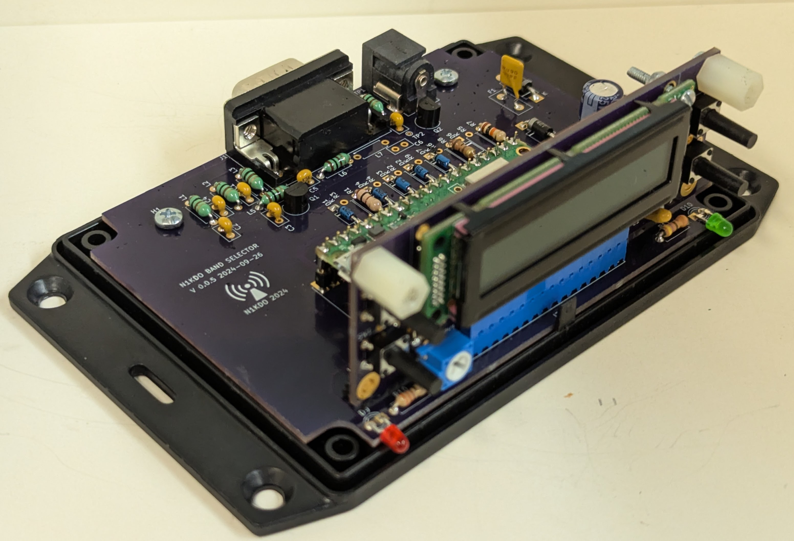
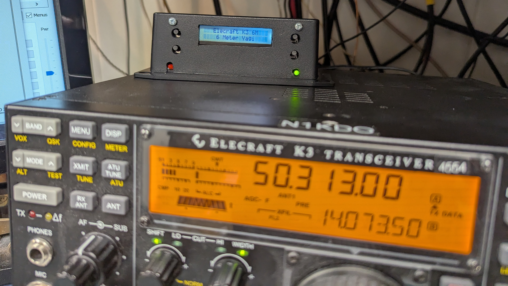

# N1KDO IOT Band Selector for Elecraft K3 & K4 

This project is intended to operate a remote antenna switch.

How is it different from commercial-off-the-shelf solutions?
* Direct interface with Elecraft 15-Pin interface. Use Y-cable
  or Y-box
  * it's not designed for other radios.
* Wireless! It runs over WiFi, connect the band selector to 
  the 15-pin accessory connector, and supply DC to the coaxial
  power jack. 
* Automatic TX Inhibit prevents TX into wrong/no antenna.
* Cheap cheap compared to existing commercial solutions. About $77 for each band selector.
* Open Source Hardware and Software.  Do what you will with attribution.

 Band Selector

 Interfaced with K3

# How it works

Each of two Elecraft K3 or K4 radios is connected to a Band Selector, which
is also provided DC power.  That is all the wiring that is needed at the radio.

The Band Selectors both communicate with a
[Antenna Switch Controller](https://github.com/n1kdo/AntennaSwitchControl), 
which provides control voltage steering to a antenna switch.  

The project is in two pieces:

  * The [Antenna Switch Controller](https://github.com/n1kdo/AntennaSwitchControl) provides a IOT endpoint for managing a 2x6 or 2x8
    antenna switch: https://github.com/n1kdo/AntennaSwitchControl
  * The Band Selector interfaces with a K3 or K4 radio, and provides the following functions:
    * Decodes selected bands from Elecraft radio AUX jack.
    * Requests antenna from the controller.
    * If the requested band antenna cannot be selected, activate the radios' TX INHIBIT
      logic to prevent transmit.
    * The Band Selector includes a 2nd circuit board for the display.
  
This repository contains the hardware and software for The Band Selector: 
  * `kicad` folder contains the electronic design.
  * `src` folder contains the software.
  * [Bill of Materials](BOM.md "Bill of Materials")

## Setup

  * Connect the BandSelector to the K3/K4 using the 15-pin "y" cable supplied by
    Elecraft.  Band select data and power status will be communicated to the 
    BandSelector.
  * Connect the BandSelector to 10-15 volts DC via the rear panel power jack 
    which accepts a 2.00mm ID, 5.50mm OD coaxial power plug, center positive.

### Setup TX Inhibit

If the band selector cannot grant access to an appropriate antenna for the
band selected on the radio, it can "inhibit" transmit on the radio, which
is useful for protecting the transmitter and amplifier from damage due to 
antenna mismatch.

When the BandSelector inhibits transmit, the red LED on the lower left
of the front panel will light.

The radios must be configured to accept the inhibit input from the 
Band Selector.  Instructions for K3 and K4 are below.  The electrical
interface from the Band Selector is an "open drain" from a 2N7000 MOSFET

  * On a K3, locate the "TX INH" option in the "CONFIG" menu.  
    Set this option to "LO=Inh".  
    When transmit is inhibited, the "TX" indicator (right side of
    display, between the A and B VFO labels) will blink.
  * on a K4, locate the "TX Inhibit Mode" option in "MENU".  
    Set this option to "LO=Inhibit".  
    When transmit is inhibited, the TX label (top center of display)
    will display "TX Inh".

# License

The software is licensed under [BSD "2-Clause" license](Software-License.md), 
_except as where noted._

The hardware is licensed under terms of the 
[Creative Commons Attribution-ShareAlike 4.0 
International Public License.](Hardware-License.md)