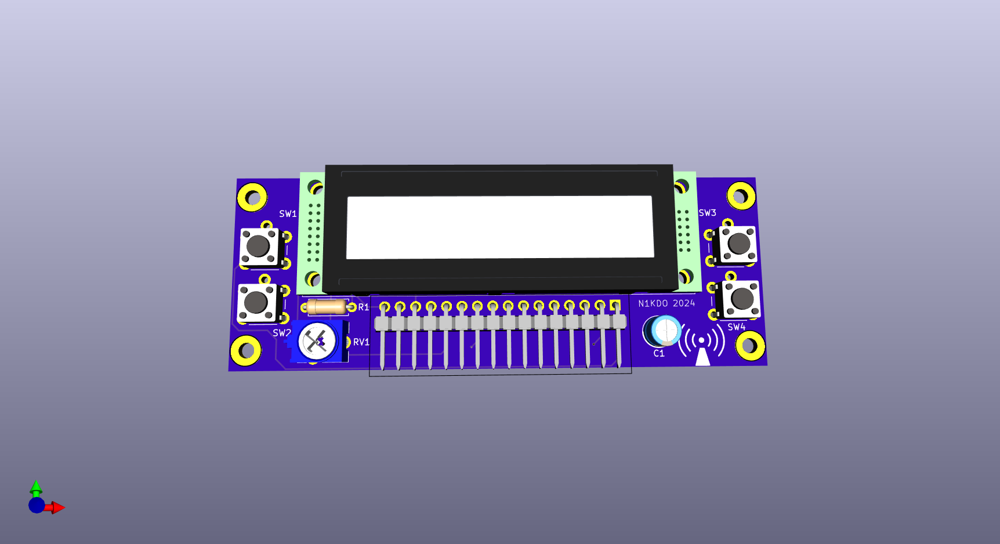
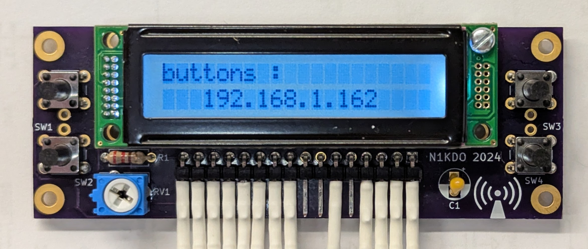

# display-board

This is a carrier for a 2x20 LCD display.  It has 4 pushbuttons that are
pull-to-ground.

The module is intended to mount in the front part of the cover of a Hammond
1591XXSFLBK enclosure.  Note that I have not actually tried this yet.

The board has a cut-out for the visible part of the display, and holes marking
all the pushbutton actuators.  The intent is that a bare board can be used as a 
template to mark the enclosure for drilling.

3d mockup from Kicad:

Prototype 1:

Design PDFs

[Schematic PDF](display-board.kicad_sch.pdf)

[Layout PDF](display-board.kicad_pcb.pdf)

* cad_models contains the downloaded vendor assets for symbols, footprints, 3-d models

